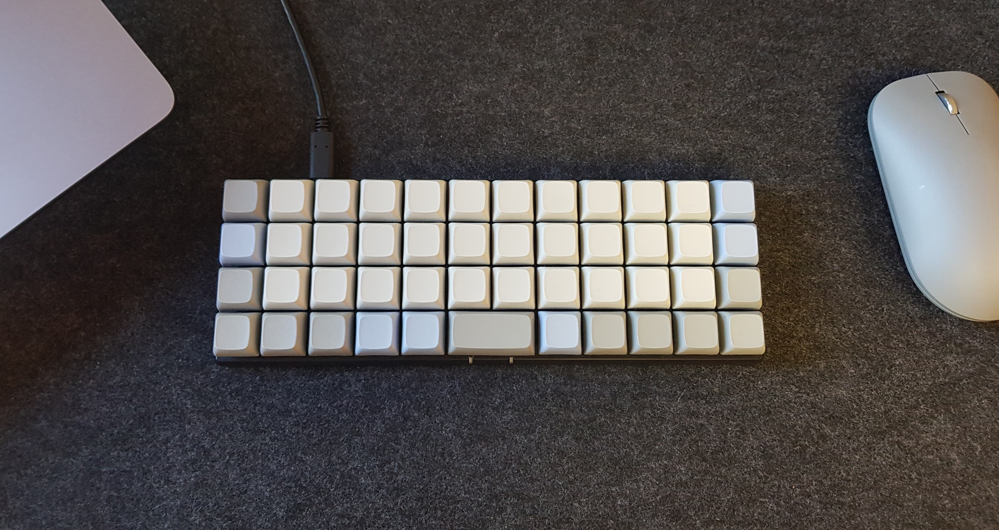

# Semonje Planck EZ
My Planck EZ keyboard layout. It relies on the standard Norwegian (Mac) layout in order to work as intended.



## Layers
At the moment, I'm using four different layers:
- **Main**: QWERTY layout with additional Norwegian characters.
- **Lower**: Useful keys for programming, like parantheses, brackets, etc.
- **Raise**: Number pad and arrows in VIM style.
- **Adjust**: Function keys and settings layer for resetting the keyboard, controlling RGB lights, etc.

## Build
Enable debug mode on your keyboard and run
``` bash
# Clone this repo to your QMK directory
git clone https://github.com/kvasimon/planck ${QMK_LOCATION}/keyboards/planck/keymaps/semonje-ez

# In github.com/qmk/qmk_firmware
make planck/light:semonje-ez:dfu
```

Otherwise, refer to the [Planck keyboard](https://github.com/qmk/qmk_firmware/tree/master/keyboards/planck) at [QMK](https://github.com/qmk/qmk_firmware) for setup and general build instructions.
